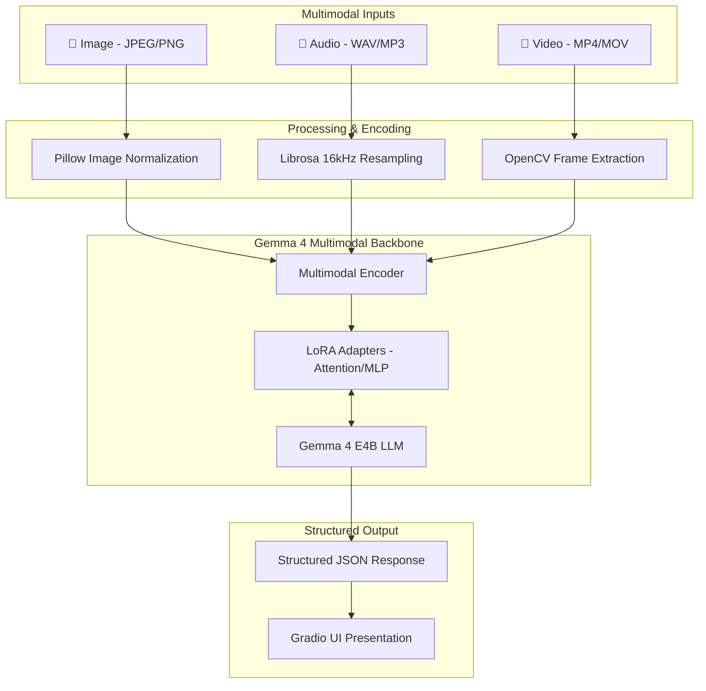
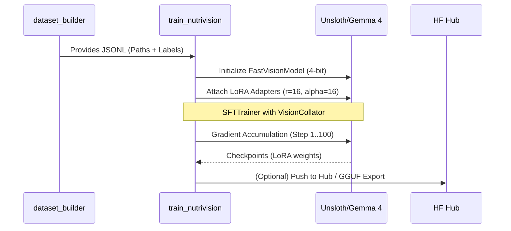
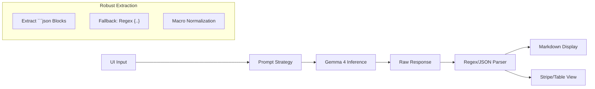

# 🥗 NutriVision

[](https://github.com/unslothai/unsloth)
[](https://huggingface.co/google/gemma-4-E4B-it)
[](https://gradio.app)
[](colab_setup.py)

**NutriVision** is a next-generation multimodal nutrition assistant built by fine-tuning **Gemma 4 E4B** using **Unsloth**. It provides instant nutritional breakdowns from images, voice logs, and video walkthroughs, converting messy multimodal inputs into structured JSON data.

## 🏗️ Technical Architecture

NutriVision leverages a unified multimodal architecture where Image, Audio, and Video signals are processed through a frozen/LoRA-adapted encoder and fused into the Gemma 4 language backbone.

### System Overview


## 🔄 Multimodal Workflow

The project follows a linear pipeline from synthetic data generation to interactive inference.

### 1. Data Engineering (`dataset_builder.py`)
To enable multimodal analysis, we construct a heterogeneous dataset:
-   **Image Logic**: Maps Food-101 labels to a nutritional ground truth database.
-   **Audio Logic**: Uses `gTTS` to synthesize natural language meal logs (e.g., *"I had two eggs"*), creating paired Audio/Text samples.
-   **Video Logic**: Simulates plate walkthroughs by generating temporal sequences of image crops, mimicking camera movement.

### 2. Training Pipeline (`train_nutrivision.py`)
We employ **QLoRA (4-bit Quantized LoRA)** to allow training on consumer-grade GPUs (12GB VRAM).



## 🛠️ Implementation Deep Dive

### Efficient Multimodal LoRA
Unlike standard text-only LoRA, NutriVision adapts both the language layers and the cross-modal attention mechanisms:

```python
model = FastVisionModel.get_peft_model(
    model,
    finetune_vision_layers     = True, # Adapts the vision encoder
    finetune_language_layers   = True, # Adapts the LLM layers
    finetune_attention_modules = True, # Adapts cross-attention
    finetune_mlp_modules       = True,
    r = 16,
    use_rslora = True          # Rank-stabilized LoRA for stability
)
```

### Prompt Engineering & Interleaving
Gemma 4 requires a specific interleaving of modalities. Images and Audio must precede the text instruction within the chat template:

```python
# Unified Content Interleaving
content = [
    {"type": "image", "image": img_object}, # Modality first
    {"type": "audio", "audio": wav_array},  # Modality first
    {"type": "text",  "text": "Analyze this meal."}
]
messages = [{"role": "user", "content": content}]
```

## 🚀 Optimization Specs

| Optimization | Method | Impact |
| :--- | :--- | :--- |
| **Quantization** | 4-bit BitsAndBytes | Reduces VRAM from 32GB to 9GB |
| **Memory** | Gradient Checkpointing | Enables 2048 sequence length on T4 |
| **Speed** | Unsloth Kernels | 2x-3x faster than standard Transformers |
| **Stability** | RS-LoRA | Prevents loss spikes in multimodal fusion |
| **Quantization** | Q4_K_M GGUF | Compression for high-speed edge inference |

## 🛠️ Inference Architecture

The Gradio application implements a robust parsing layer to handle the stochastic nature of LLM outputs, ensuring the UI always receives valid structured data.



### Response Parsing Logic
To ensure the UI is "crash-proof," we use a multi-stage parser that extracts JSON even if the model surrounds it with conversational text:

```python
def format_nutrition_output(raw_text: str):
    # 1. Primary: Markdown code block extraction
    if "```json" in raw_text:
        text = raw_text.split("```json")[1].split("```")[0].strip()
    # 2. Secondary: Regex greedy match for curly braces
    else:
        import re
        matches = re.findall(r'\{.*\}', raw_text, re.DOTALL)
        text = matches[0] if matches else raw_text
    
    # 3. Presentation: Convert to specific UI elements
    data = json.loads(text)
    return build_markdown(data), json.dumps(data, indent=2)
```

- 📸 **Visual Analysis**: Identify food items and estimate portions directly from photos.
- 🎤 **Voice Logging**: Speak naturally (e.g., *"I had two chapatis and dal for lunch"*) and get an automatic log.
- 🎥 **Video Walkthroughs**: Record your plate for a comprehensive scan of complex meals.
- 📊 **Structured Insights**: Predicts calories, protein, carbs, fat, fiber, and provides a health score (1-10).
- ⚙️ **Optimized Fine-tuning**: Uses QLoRA via Unsloth for 2x faster training and 70% less memory usage.
- 🧊 **GGUF Export**: Ready for local deployment on mobile or edge devices via llama.cpp.

## 🚀 Getting Started

### 📋 Prerequisites

- **Hardware**: NVIDIA GPU with ~12GB VRAM (Colab T4, L4, or local RTX 3060+).
- **Python**: 3.10 or higher.

### 🛠️ Installation

1. **Clone the repository**:
   ```bash
   git clone https://github.com/your-repo/nutrivision.git
   cd nutrivision
   ```

2. **Install dependencies**:
   ```bash
   pip install -r requirements.txt
   ```

3. **Install Unsloth** (specifically for your environment):
   ```bash
   # For Colab/Kaggle:
   pip install "unsloth[colab-new]"
   
   # For local Linux/Windows:
   pip install unsloth
   ```

## 🏗️ Workflow

### 1. Data Preparation
Build a synthetic or custom multimodal dataset using `dataset_builder.py`. This script handles image generation, audio synthesis (TTS), and JSONL formatting.
```bash
python dataset_builder.py
```

### 2. Fine-tuning
Train the model using the efficient LoRA script. It is configured for `gemma-4-E4B-it` by default.
```bash
python train_nutrivision.py
```
*Note: Check `train_nutrivision.py` to toggle vision/language/attention fine-tuning parameters.*

### 3. Launch the App
Run the interactive Gradio interface to test your model.
```bash
python gradio_app.py --share
```

## 🧠 Tech Stack

- **Large Multimodal Model**: [Gemma 4 E4B](https://huggingface.co/google/gemma-4-E4B-it)
- **Fine-tuning Engine**: [Unsloth](https://unsloth.ai)
- **Training Framework**: PyTorch, Hugging Face Transformers, TRL, PEFT.
- **Data Processing**: Pillow (Images), Librosa (Audio), OpenCV (Video).
- **UI**: Gradio.
- **Dataset Synthesis**: gTTS (Speech).

## 📊 Example Output

The model generates structured JSON like this:
```json
{
  "food": "Margherita Pizza",
  "serving": "2 slices",
  "calories": 520,
  "macros": {
    "protein_g": 22,
    "carbs_g": 64,
    "fat_g": 18,
    "fiber_g": 4
  },
  "health_score": 5,
  "tip": "High in sodium and refined carbs. Pair with a fresh salad to improve fiber intake."
}
```

## 📝 Disclaimer

NutriVision provides nutritional **estimates** based on AI analysis. These outputs are for informational purposes only and should not replace professional medical advice or clinical dietetics.

---
Built with ❤️ using **Unsloth** and **Gemma 4**.
